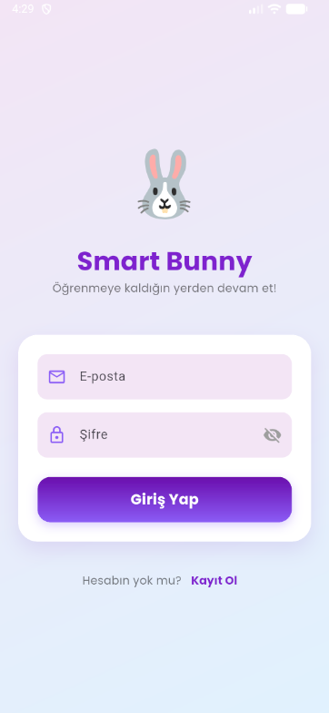
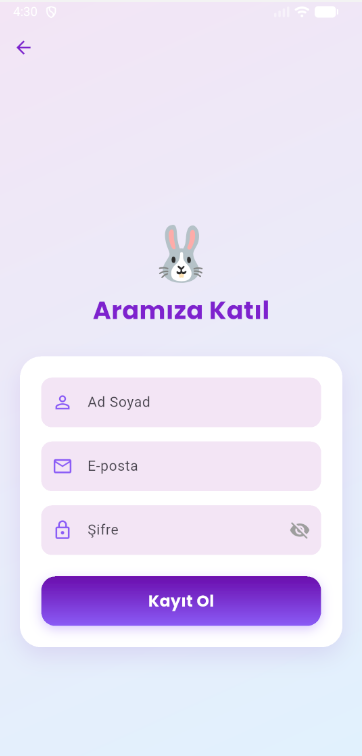
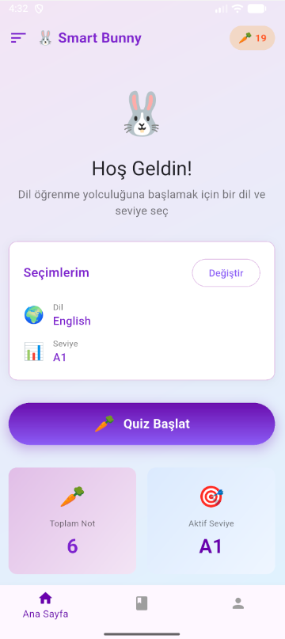
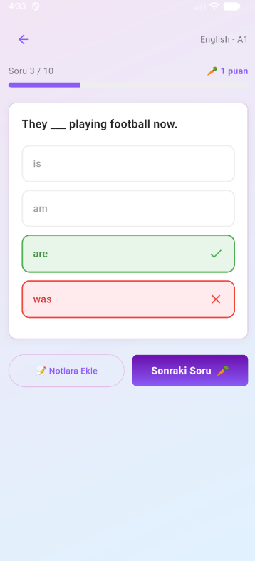
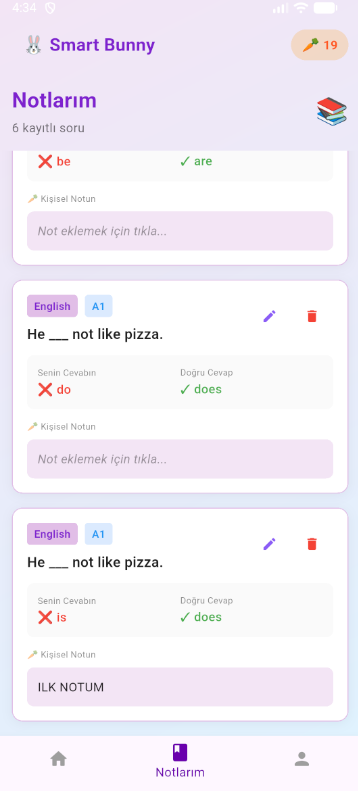
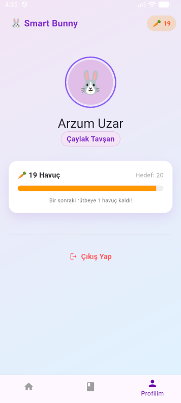

# 🐰 Smart Bunny

**Smart Bunny**, İngilizce ve Fransızca dillerinde farklı seviyelerde (A1-C2) interaktif testler çözerek dil öğrenimini pekiştiren, oyunlaştırılmış (gamification) bir mobil uygulamadır.

### 🚀 Projenin Amacı ve Özellikleri
Kullanıcılar seçtikleri dilde quiz çözerek "havuç" (puan) toplar ve Çaylak Tavşan'dan Efsanevi Tavşan'a kadar rütbe atlar. Uygulama, yanlış cevaplanan soruları kaydedip üzerine kişisel notlar alınmasına imkan tanıyarak öğrenme sürecini destekler.

### 🛠️ Kullanılan Teknolojiler
* **Flutter & Dart:** Kullanıcı arayüzü ve uygulama mantığı.
* **Supabase:** Kimlik doğrulama (Auth) ve gerçek zamanlı veritabanı yönetimi.
* **Dinamik İçerik:** A1'den C2'ye kadar seviye bazlı soru filtreleme sistemi.

## 📸 Uygulama İçi Görseller

Projenin temel ekranları aşağıdadır:

|  |   |  |  |  |  |